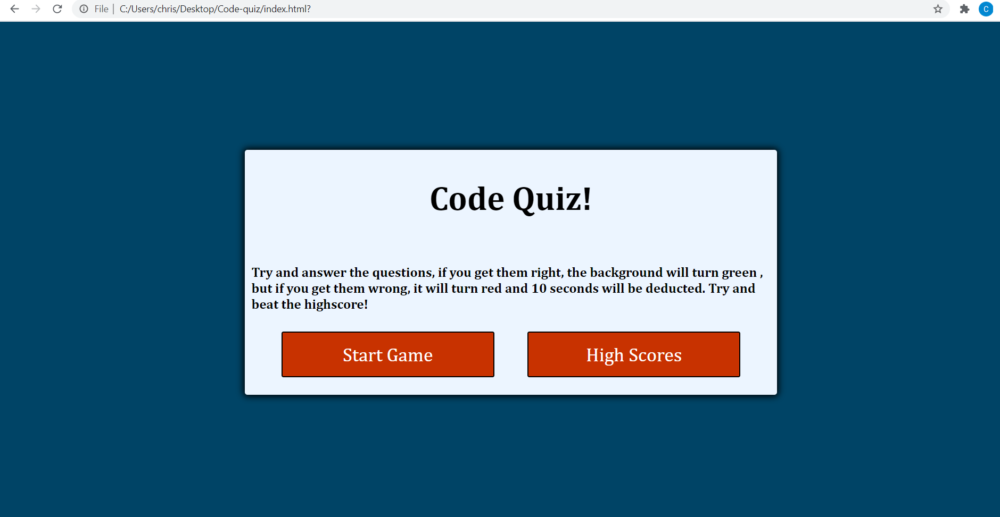

# Code Quiz

## What it is:

    This is a cool little code quiz game that I made using HTML CSS and JavaScript. It was a good
    test of my new abilities and I learned a lot doing it.

## How it works:

    All you have to do it is press the start button and it starts playing, you have 90 seconds to complete the quiz, and if you get a correct answer, the background turns green, and if you get a wrong answer, it turns red and you lose 10 seconds off the timer. At the end your seconds left are your score and you have the chance to put your name and score into a high score list. This is accessible from the main screen, and once in the list you have the option to clear the list of all the high scores.

## What I learned:

    This activity taught me a lot. It was a lot of trial and error and going at it from different directions to try and get what I wanted it to do. I learned a lot about using JavaScript to manipulate the DOM, and also it was good to expand on my HTML and CSS skills to make this project look nice as well. There are a few things that did not work as good as I would like them to have, and hopefully as I learn more about JavaScript and programming I will be able to come back and update this project so that it is perfect.

## Closing:

    I had an interesting time with this project, but it's nice to make things that have an end result, and something that is fun to use when it is complete as well. I felt a great sense of accomplishment with every step that I took.